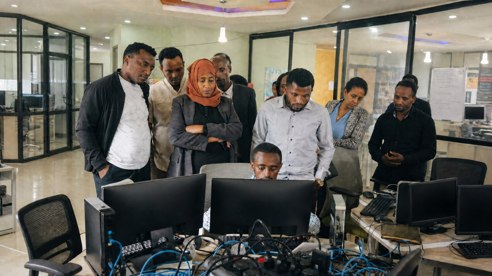

<div align="center">

# 🧬 TADIYOS ASCHALEW 
### ታዲዮስ አስቻለው
**[Software & AI Engineer](https://nexuss.pro.et/) · [Ethco Coder](https://github.com/ethcocoders) · [Founder](https://github.com/Nexuss-Intelligence)**


[](https://github.com/nexuss0781)
[](https://huggingface.co/Nexuss0781)
[](https://t.me/Nexuss_stuff)
[](https://www.linkedin.com/in/nexuss0781/)
[](https://nexuss.pro.et/)
[](https://github.com/Nexuss-Intelligence)
[](https://github.com/ethcocoders)
[](https://github.com/nexuss0781)

---

> ***"𝐼 𝑑𝑜𝑛'𝑡 𝑏𝑢𝑖𝑙𝑑 𝑜𝑛 𝑤ℎ𝑎𝑡'𝑠 𝑎𝑙𝑟𝑒𝑎𝑑𝑦 𝑎𝑠𝑠𝑢𝑚𝑒𝑑. 𝐼 𝑟𝑒𝑡𝑢𝑟𝑛 𝑡𝑜 𝑤ℎ𝑒𝑟𝑒 𝑡ℎ𝑒 𝑎𝑠𝑠𝑢𝑚𝑝𝑡𝑖𝑜𝑛𝑠 𝑏𝑒𝑔𝑎𝑛—𝑎𝑛𝑑 𝑟𝑒𝑏𝑢𝑖𝑙𝑑 𝑓𝑟𝑜𝑚 𝑡ℎ𝑒𝑟𝑒."***

</div>

---

## 🎯 Executive Vision

I'm a 20 y/o self-taught engineer from **Ethiopia** building the next generation of intelligent systems from first principles. No institution handed me this path. What drives every line of code here is a single conviction: **the foundations most people accept as fixed can, in fact, be rebuilt**.

Current AI hits hard ceilings—transformers scale quadratically, models forget what they learn, systems correlate but don't reason about causation. These aren't engineering problems. They're *architectural problems* requiring rethinking from the ground up.

That's what I do. I find the broken foundation. Understand why it broke. Rebuild it properly.

---

## 🛍️ Flagship Innovations

### 🌟 [Walia — The Sovereign Programming Language](https://github.com/nexuss0781/Walia)

- **Purpose:** A fifth-generation programming language built around persistent, stateful computation.
- **Core capabilities:**
  - Orthogonal persistence keeps variables available across restarts, power failures, and reboots without explicit serialization.
  - Register-based virtual machine with NaN-boxing.
  - Neural-native vectors as first-class values.
  - Dimensional typing that enforces physical relationships at compile time.

```walia
var session_count = 0;  // Persists automatically
session_count = session_count + 1;
print "Session #" + session_count;  // Survives across restarts
```

### 🧠 [Nexuss Neural Cognition — 270K Neurons in 500MB](https://github.com/nexuss0781/Nexuss-Neural-Cognition)

- **Purpose:** A biologically plausible spiking-neural-network simulator designed for large cognitive models within a fixed memory budget.
- **Scale:** 270,336 neurons and 13,516,800 synapses within 500 MB of RAM.
- **Architecture:** Universal Intellectual Neuron (UIN) building blocks with six neuron classes and five synapse types.
- **Performance:** O(1) update kernel reported at 94× real-time speedup, with a meta-cognitive controller for adaptive resource allocation.

### 🖼️ [Image-text — Atomic Logic Vision System (ALVS)](https://github.com/nexuss0781/Image-text)

- **Purpose:** A hybrid C++/Python image-processing engine that converts visual data into mathematical logic atoms.
- **Representation:** RGB matrix, Energy (luminance), and Flow (gradient) layers.
- **Performance:** Sub-200 ms processing for 8K UHD images, reported throughput of 508 MB/s, and lossless reconstruction with PSNR above 66 dB.

### 🤖 [Ardi-Agents — Sixteen Specialist AI Council](https://github.com/nexuss0781/Ardi-Agents)

- **Purpose:** An autonomous multi-agent orchestration engine for complex, end-to-end workflows.
- **Specialists:** Sixteen domain-focused agents covering language, analysis, innovation, frontend and backend development, debugging, QA planning, code quality, security, performance, UX, adversarial testing, and documentation.
- **Coordination:** Meta-cognitive planning connects specialist outputs into a collaborative development process.

### 🌐 [Nexuss Transformer Framework — Blank Slate to Superintelligence](https://github.com/nexuss0781/Nexuss-Transformer)

- **Purpose:** A production-oriented framework for training decoder-only large language models from scratch.
- **Model components:** RoPE embeddings, RMSNorm, SwiGLU, and Multi-Query Attention.
- **Training lifecycle:** Pre-training, LoRA fine-tuning, and RLHF alignment through PPO/DPO.
- **Language support:** Integrates EthioBBPE for Amharic and Ge'ez tokenization.

### 🥏 [Attention Kernel — Metric-Aware Geometry](https://github.com/nexuss0781/Attention)

- **Purpose:** A C++20 numerical kernel for metric-aware attention geometry.
- **Operations:** Builds learned positive-definite metrics, computes symmetric whitening operators, and transforms query/key coordinates.
- **Design targets:** Deterministic F32 CPU tensors and context lengths up to one million tokens.
- **Validation:** Forward-path checks include numerical guards and condition-number bounds.

### 🛸 [CDI — Compact Causal Language Engine](https://github.com/nexuss0781/CDI)

- **Purpose:** An evidence-gated research implementation of selective cohomodynamic recurrent state-space models for causal language processing.
- **Current implementation:** CDI v3 uses the EthioBBPE tokenizer, sparse graph-Laplacian correction, and tied output projection.
- **Reported results:** CCT-G3.4 showed a 21% throughput improvement from token-residual evidence; CCT-G3.6 achieved bounded continuation at 6.576891 validation loss and outperformed GRU baselines across all seeds.
- **Verification:** 297 tests pass, with geometry re-confirmed through the G3.1–G3.6 gates.

---

## 📚 Complete Repository Showcase

### 🧠 Intelligence Architecture
| Repository | Purpose |
|------------|---------|
| [Attention](https://github.com/nexuss0781/Attention) | C++20 metric-aware attention kernel for transformer numerical geometry. |
| [Nexuss-Neural-Cognition](https://github.com/nexuss0781/Nexuss-Neural-Cognition) | Biologically-plausible spiking neural simulator with RAM-budget meta-cognitive controller. |
| [Addis-Neural-Genesis](https://github.com/nexuss0781/Addis-Neural-Genesis) | Undescribed repository — README states no project description provided. |
| [Addis-Neuron-Genesis](https://github.com/nexuss0781/Addis-Neuron-Genesis) | Bio‑inspired AGI Genesis Trinity architecture implementing streaming neurogenesis and symbolic vectors. |
| [Intellectual-Cortex-Architecture](https://github.com/nexuss0781/Intellectual-Cortex-Architecture) | High-performance Intellectual Cortex architecture with UIN building blocks and meta-cognition. |
| [CCT](https://github.com/nexuss0781/CCT) | Native C++ Chrono‑Causal Tapestry research prototype for causal-event learning and verifiable memory. |
| [alien-intelligence](https://github.com/nexuss0781/alien-intelligence) | Research C++ implementation exploring sub-quadratic neural architectures for language modeling. |
| [Multi-Head-Attention](https://github.com/nexuss0781/Multi-Head-Attention) | CPU-native tensorized multi-head attention with CP factorization and uncertainty-adaptive routing. |
| [Positional-Encoding](https://github.com/nexuss0781/Positional-Encoding) | Hierarchical digit positional encoding (HDPE) replacing RoPE with cache‑oblivious, log‑time composition. |
| [QKV-Projection](https://github.com/nexuss0781/QKV-Projection) | Sub-quadratic factorized QKV projection using diagonal-plus-low-rank and butterfly residuals. |
| [Scaled-Dot-Product-Attention](https://github.com/nexuss0781/Scaled-Dot-Product-Attention) | Linear-time spectrally‑gated recurrent kernel attention with uncertainty and adaptive compute depth. |
| [small-transformer](https://github.com/nexuss0781/small-transformer) | Self-contained CPU-only SmolLM2 135M instruct chat with terminal UI and Docker deployment. |

### ⚛️ Quantum & Language Computing
| Repository | Purpose |
|------------|---------|
| [Walia](https://github.com/nexuss0781/Walia) | 5th‑generation programming language with orthogonal persistence, register VM, neural vectors, dimensional typing. |
| [Dot-NXV](https://github.com/nexuss0781/Dot-NXV) | Lightweight from‑scratch OCR engine combining classical image processing and a small neural recognizer. |
| [Nexuss-Bash](https://github.com/nexuss0781/Nexuss-Bash) | Containerized remote execution and developer sandbox with CLI, YAML pipelines and PTY sessions. |
| [Terminal-kit](https://github.com/nexuss0781/Terminal-kit) | Backend control plane to register, enroll, route commands, and stream remote terminal instances. |
| [terminalkit-docker](https://github.com/nexuss0781/terminalkit-docker) | Dockerized Terminal‑Kit agent for self‑enrolling instances, status reporting, and command streaming. |

### 🤖 Autonomous Agents
| Repository | Purpose |
|------------|---------|
| [Ardi-Agents](https://github.com/nexuss0781/Ardi-Agents) | Production‑grade multi‑agent orchestration engine coordinating sixteen specialist AI experts for autonomous workflows. |
| [Ardi_agent](https://github.com/nexuss0781/Ardi_agent) | JavaScript agentic AI system orchestrating specialized agents for autonomous web application development. |
| [Open-hand-Bot](https://github.com/nexuss0781/Open-hand-Bot) | Flask‑based Telegram bot to notify users when OpenHands tasks finish; designed for Vercel deployment. |

### 👁️ Sensory Substrates
| Repository | Purpose |
|------------|---------|
| [NASS](https://github.com/nexuss0781/NASS) | High‑performance audio substrate converting audio into lossless STFT tensors with zero‑copy parallel processing. |
| [Image-text](https://github.com/nexuss0781/Image-text) | Atomic Logic Vision System (ALVS): hybrid C++/Python engine decomposing images into RGB, Energy, and Flow atoms. |
| [Text-tokenizer](https://github.com/nexuss0781/Text-tokenizer) | Cognition‑optimized BPE tokenizer using an FST, LOUDS trie, CHD decoder, and entropy‑weighted training. |
| [Ethio_BBPE](https://github.com/nexuss0781/Ethio_BBPE) | Production‑ready BPE tokenizer tailored for Amharic and Ge'ez with HuggingFace model and Python API. |
| [Nexuss_Embedding](https://github.com/nexuss0781/Nexuss_Embedding) | Hierarchical frequency‑adaptive quantized embedding (HFAQE) saving embedding memory with hot/cold tiers. |
| [Nexuss-AI](https://github.com/nexuss0781/Nexuss-AI) | End‑to‑end framework for training, fine‑tuning, aligning, and deploying large language models from scratch. |
| [Nexuss-Transformer](https://github.com/nexuss0781/Nexuss-Transformer) | Production‑grade decoder‑only transformer framework supporting blank‑slate pretraining, LoRA, RLHF, and EthioBBPE. |
| [HOLY-AI](https://github.com/nexuss0781/HOLY-AI) | GPT‑2 training repository with data loaders and training scripts for Synaxarium and biblical datasets. |

### 🌐 Web & Applications
| Repository | Purpose |
|------------|---------|
| [CDI](https://github.com/nexuss0781/CDI) | Research implementation of a compact causal language engine (cdi.v3) with CCT‑gated experiments; not production ready. |
| [Input-Trio](https://github.com/nexuss0781/Input-Trio) | C++ cognition‑optimized tokenizer (Nexuss Tokenizer) focused on FST encoding, LOUDS trie, and parallel encoding. |
| [Nexuss-IDE](https://github.com/nexuss0781/Nexuss-IDE) | Mobile‑first self‑hosted full‑stack IDE using Monaco editor, Flask backend, and Python plugin architecture. |
| [Nexuss-Studio](https://github.com/nexuss0781/Nexuss-Studio) | Dual‑window AI chat studio offering study and coding modes with PDF reader and multi‑model AI integration. |
| [Nexuss-Education](https://github.com/nexuss0781/Nexuss-Education) | PDF study assistant with AI chat, multi‑model routing, smart API key rotation, and vision model support. |
| [Nexuss-Chat](https://github.com/nexuss0781/Nexuss-Chat) | Full‑featured PHP real‑time chat application with authentication, presence, groups, and file sharing. |
| [Nexuss-Media](https://github.com/nexuss0781/Nexuss-Media) | Emoji image asset collection rendered from Apple Color Emoji covering Unicode v13.1 and composites. |
| [Nexuss-Playground](https://github.com/nexuss0781/Nexuss-Playground) | Zero‑backend multi‑model AI web app with web search, code intelligence, and local‑first persistence. |
| [Nexuss-Notes](https://github.com/nexuss0781/Nexuss-Notes) | Premium PHP note‑taking app with Ethiopian calendar support, PWA features, and offline caching. |
| [Nexuss-Monitor](https://github.com/nexuss0781/Nexuss-Monitor) | Command‑line uptime monitor client for Nexuss‑Cronjob supporting interactive and non‑interactive agent usage. |
| [Nexuss-Cronjob](https://github.com/nexuss0781/Nexuss-Cronjob) | Real‑time uptime monitoring platform with React frontend, Vercel serverless backend, JWT auth, and customizable checks. |
| [browser-kit](https://github.com/nexuss0781/browser-kit) | AI‑facing remote Chromium control platform offering sessions, observation, scripted interaction, and evidence capture. |
| [Web-kit](https://github.com/nexuss0781/Web-kit) | Rust/Axum web search and safe page‑fetching service with provider fan‑out, SSRF protections, and markdown output. |

### 🏫 Education & Community
| Repository | Purpose |
|------------|---------|
| [NPMS-platform](https://github.com/nexuss0781/NPMS-platform) | Nexus integrated school management system supporting RBAC, academic workflows, asset tracking, and communication. |
| [Nexus-School-Management](https://github.com/nexuss0781/Nexus-School-Management) | Comprehensive school management platform implementing academic management, multi‑tiered requests, and real‑time chat. |
| [Digital-Edu](https://github.com/nexuss0781/Digital-Edu) | Filesystem‑driven competency‑based LMS with quizzes, workshops, practical IDEs, badges, and certificates. |
| [ACCX](https://github.com/nexuss0781/ACCX) | Modern secure account and credential vault with dual themes, full CRUD, categories, folders, and dashboards. |
| [Calisthenics](https://github.com/nexuss0781/Calisthenics) | Front‑end prototype of a calisthenics dashboard showcasing workouts, calendar, schedule, and health metrics. |

### 💰 Finance & Business
| Repository | Purpose |
|------------|---------|
| [ZeinthFinance](https://github.com/nexuss0781/ZeinthFinance) | Personal finance dashboard web application for income/expense tracking, categories, and analytics. |
| [Trusted-Pay](https://github.com/nexuss0781/Trusted-Pay) | Secure wallet and Telegram bot platform with Telebirr receipt verification, admin dashboard, and dispute workflows. |
| [C9-Marketing](https://github.com/nexuss0781/C9-Marketing) | Full‑stack e‑commerce platform with React frontend, Flask backend, JWT auth, and product management. |

### 🔧 Infrastructure & DevOps
| Repository | Purpose |
|------------|---------|
| [FTP-Client](https://github.com/nexuss0781/FTP-Client) | Development‑stage FTPS client library with stable C ABI and Python bindings; M0 baseline, not production ready. |
| [nexuss-auth](https://github.com/nexuss0781/nexuss-auth) | Centralized OAuth authentication service and TypeScript SDK supporting Continue with Google and GitHub. |
| [PDF-BOT](https://github.com/nexuss0781/PDF-BOT) | Telegram PDF classifier bot using hierarchical range parsing, Vercel webhook, and optional Render worker for large files. |
| [NexussOS](https://github.com/nexuss0781/NexussOS) | Bare‑metal bootloader and minimal kernel with framebuffer; kexec‑style loader to hand off to another OS. |
| [YOB-OS](https://github.com/nexuss0781/YOB-OS) | Cloud‑synchronized HTML operating system with Play Store, web shell, and Expo Android client. |
| [NexussREV](https://github.com/nexuss0781/NexussREV) | High‑fidelity binary decompiler and analysis framework for program reconstruction using Capstone and LIEF. |

---

## 🛠️ Technical Mastery

| Domain | Technologies | Impact |
|--------|-------------|--------|
| **AI/ML** | Spiking networks, spectral attention, continual learning, RLHF | O(n) attention, 270K neuron self-optimizing networks |
| **Languages** | Register VMs, orthogonal persistence, dimensional typing | Walia: variables survive restarts by default |
| **Quantum** | Native primitives on classical hardware (ASC, RPW, NCB) | GHZ states, Bell verification on laptops |
| **Distributed Systems** | Circuit breakers, zero-copy I/O, exponential backoff | 2,050% throughput improvement in FTP |
| **NLP** | BPE for Ethiopian scripts, blank-slate training | Amharic, Ge'ez, biblical text processing |
| **Signal Processing** | STFT, SIMD optimization, lossless conversion | 245× audio processing speedup |
| **Full-Stack** | React, TypeScript, Flask, FastAPI, TailwindCSS | 9-role school management, 140+ API routes |

---

## 🤝 Let's Build

I work where current approaches plateau. If you care about:
- 🎯 Rebuilding AI foundations instead of scaling broken assumptions
- ✓ Mathematical proofs over empirical approximations
- 🌍 Technology serving underserved language communities
- 🚀 Production systems that actually ship
- ⚛️ Quantum-classical computing on available hardware
- 🧠 Cognitive architectures that accumulate knowledge

Let's talk.

**📧 nexuss0781@gmail.com**

---

<div align="center">



*Self-taught. Community-rooted. Foundation-first.*

**Find the broken foundation. Understand why it broke. Rebuild it properly.**

---

### 🌟 Connect

[](mailto:nexuss0781@gmail.com)
[](https://github.com/nexuss0781)
[](https://huggingface.co/Nexuss0781)
[](https://pypi.org/project/EthioBBPE/)

---

## 📊 GitHub Stats

<div align="center">

  <a href="https://github.com/nexuss0781">
    
  </a>
  <a href="https://github.com/nexuss0781">
    
  </a>

  <a href="https://github.com/nexuss0781">
    
  </a>

  <a href="https://github.com/nexuss0781">
    
  </a>

  <a href="https://github.com/nexuss0781">
    
  </a>

  

</div>

---

## 🎨 Visual Collection

<div align="center">

### Profile Badges


### AI/ML Stack


### Research Status


### Neural Architecture


### Languages & Compilers


### Agents & Automation


### Security & Infrastructure


### Applications


### Dynamic Stats


### Star History
[](https://star-history.com/#nexuss0781/Walia&nexuss0781/Attention&nexuss0781/Nexuss-Transformer&nexuss0781/CDI&Date)

</div>

---

<div align="center">

**Built from First Principles · Powered by First Principles**

© 2024 Tadiyos Aschalew · All Foundations Rebuilt

</div>
