<!-- Colorful Animated Line -->


<div align="center">

# 🧬 TADIYOS ASCHALEW 
### ታዲዮስ አስቻለው
**Software & AI Engineer · [Ethco Coder](https://github.com/ethcocoders) · [Founder](https://github.com/Nexuss-Intelligence)**

---

[](https://github.com/nexuss0781)
[](https://huggingface.co/Nexuss0781)
[](https://t.me/Nexuss_stuff)
[](https://www.linkedin.com/in/nexuss0781/)
[](https://nexuss.pro.et/)
[](https://github.com/Nexuss-Intelligence)
[](https://github.com/ethcocoders)
[](https://github.com/nexuss0781)

---

> ***"𝐼 𝑑𝑜𝑛'𝑡 𝑏𝑢𝑖𝑙𝑑 𝑜𝑛 𝑤ℎ𝑎𝑡'𝑠 𝑎𝑙𝑟𝑒𝑎𝑑𝑦 𝑎𝑠𝑠𝑢𝑚𝑒𝑑. 𝐼 𝑟𝑒𝑡𝑢𝑟𝑛 𝑡𝑜 𝑤ℎ𝑒𝑟𝑒 𝑡ℎ𝑒 𝑎𝑠𝑠𝑢𝑚𝑝𝑡𝑖𝑜𝑛𝑠 𝑏𝑒𝑔𝑎𝑛—𝑎𝑛𝑑 𝑟𝑒𝑏𝑢𝑖𝑙𝑑 𝑓𝑟𝑜𝑚 𝑡ℎ𝑒𝑟𝑒."***

</div>

---

## 🎯 Executive Vision

I'm a 20 y/o self-taught engineer from **Ethiopia** building the next generation of intelligent systems from first principles. No institution handed me this path. What drives every line of code here is a single conviction: **the foundations most people accept as fixed can, in fact, be rebuilt**.

Current AI hits hard ceilings—transformers scale quadratically, models forget what they learn, systems correlate but don't reason about causation. These aren't engineering problems. They're *architectural problems* requiring rethinking from the ground up.

That's what I do. I find the broken foundation. Understand why it broke. Rebuild it properly.

---

## 🏗️ The Ecosystem

```
                    ┌─────────────────────────────────────┐
                    │   YOU ARE HERE: NEXUSS ECOSYSTEM    │
                    └─────────────────────────────────────┘
                                    │
        ┌───────────────────────────┼───────────────────────────┐
        │                           │                           │
   ┌────▼────┐              ┌───────▼───────┐           ┌──────▼──────┐
   │ WALIA   │              │   ATTENTION   │           │   CDI       │
   │ Language│              │   Kernels     │           │ Causal AI   │
   └────┬────┘              └───────┬───────┘           └──────┬──────┘
        │                           │                           │
        └───────────────────────────┼───────────────────────────┘
                                    │
        ┌───────────────────────────┼───────────────────────────┐
        │                           │                           │
   ┌────▼────┐              ┌───────▼───────┐           ┌──────▼──────┐
   │ ARDI    │              │  TRANSFORMER  │           │NEURAL COG   │
   │ Agents  │              │   Framework   │           │ 270K Neurons│
   └─────────┘              └───────────────┘           └─────────────┘
```

---

## Flagship Innovations

### Walia — The Sovereign Programming Language

- A 5th generation programming language where code doesn't just run—it lives forever. Orthogonal persistence built into the core: variables survive restarts, power failures, and reboots without serialization. Register-based VM with NaN-boxing. Neural-native vectors as first-class citizens. Dimensional typing enforces physics at compile time.

```walia
var session_count = 0;  // Persists automatically
session_count = session_count + 1;
print "Session #" + session_count;  // Survives across restarts
```

### Nexuss Neural Cognition — 270K Neurons in 500MB

- Biologically-plausible spiking neural network simulator operating 270,336 neurons and 13,516,800 synapses within a fixed 500MB RAM budget. Features Universal Intellectual Neuron (UIN) building blocks with 6 neuron classes and 5 synapse types. O(1) update kernel achieving 94× real-time speedup. Meta-cognitive controller with adaptive resource allocation.

### Image-text — Atomic Logic Vision System (ALVS)

- High-performance hybrid image processing engine decomposing visual data into mathematical logic atoms: RGB matrix, Energy (luminance), and Flow (gradient) layers. C++ backend with Python interface. Sub-200ms processing for 8K UHD images at 508 MB/s throughput. Lossless reconstruction with PSNR >66 dB.

### Ardi-Agents — Sixteen Specialist AI Council

- Autonomous multi-agent orchestration engine featuring 16 domain-specific AI experts: Language Expert, Analyst, Innovator, Frontend/Backend Developers, Debugger, QA Planners, Code Quality/Security/Performance/UX Auditors, Antagonistic Tester, and Documentation Generator. Meta-cognitive planning coordinates collaborative reasoning for end-to-end complex workflows.

### Nexuss Transformer Framework — Blank Slate to Superintelligence

- Production-grade framework for training Decoder-Only LLMs from scratch. Pure implementation with RoPE embeddings, RMSNorm, SwiGLU, Multi-Query Attention. Supports pre-training, LoRA fine-tuning, and RLHF alignment (PPO/DPO). Integrated with EthioBBPE tokenizer optimized for Amharic and Ge'ez scripts.

### Attention Kernel — Metric-Aware Geometry

- C++20 numerical kernel for metric-aware attention geometry. Assembles positive-definite learned metrics, computes symmetric whitening operators, transforms query/key coordinates. Handles 1M context length with deterministic F32 CPU tensors. Validated forward path with numerical guards and condition-number bounds.

### CDI — Compact Causal Language Engine

- Evidence-gated investigation of selective cohomodynamic recurrent state-space models. Active v3 implementation uses EthioBBPE tokenizer, sparse graph-Laplacian correction, and tied output projection. CCT-G3.4 earned token-residual evidence with 21% throughput improvement. CCT-G3.6 achieved bounded continuation at 6.576891 validation loss, beating GRU baselines across all seeds. 297 tests passing. Geometry re-confirmed through G3.1-G3.6 gates.
---

## 📚 Complete Repository Showcase

### 🧠 Intelligence Architecture
| Repository | Purpose |
|------------|---------|
| [Attention](https://github.com/nexuss0781/Attention) | C++20 metric-aware attention kernels |
| [Nexuss-Neural-Cognition](https://github.com/nexuss0781/Nexuss-Neural-Cognition) | Self-optimizing spiking network (270K neurons) |
| [Addis-Neural-Genesis](https://github.com/nexuss0781/Addis-Neural-Genesis) | Bio-inspired cognition architecture |
| [Addis-Neuron-Genesis](https://github.com/nexuss0781/Addis-Neuron-Genesis) | Neuron growth simulation |
| [Intellectual-Cortex-Architecture](https://github.com/nexuss0781/Intellectual-Cortex-Architecture) | Pure reasoning decoupled from biology |
| [CCT](https://github.com/nexuss0781/CCT) | Chrono-Causal Tapestry for causal AI |
| [alien-intelligence](https://github.com/nexuss0781/alien-intelligence) | Non-biological cognition models |
| [Multi-Head-Attention](https://github.com/nexuss0781/Multi-Head-Attention) | Multi-head attention variants |
| [Positional-Encoding](https://github.com/nexuss0781/Positional-Encoding) | Advanced positional encodings |
| [QKV-Projection](https://github.com/nexuss0781/QKV-Projection) | Query-Key-Value projections |
| [Scaled-Dot-Product-Attention](https://github.com/nexuss0781/Scaled-Dot-Product-Attention) | Scaled dot-product implementations |
| [small-transformer](https://github.com/nexuss0781/small-transformer) | Minimal transformer architecture |

### ⚛️ Quantum & Language Computing
| Repository | Purpose |
|------------|---------|
| [Walia](https://github.com/nexuss0781/Walia) | 5th gen language with orthogonal persistence |
| [Dot-NXV](https://github.com/nexuss0781/Dot-NXV) | .NET quantum extensions |
| [Nexuss-Bash](https://github.com/nexuss0781/Nexuss-Bash) | Shell scripting enhancements |
| [Terminal-kit](https://github.com/nexuss0781/Terminal-kit) | Terminal utilities |
| [terminalkit-docker](https://github.com/nexuss0781/terminalkit-docker) | Containerized terminal tools |

### 🤖 Autonomous Agents
| Repository | Purpose |
|------------|---------|
| [Ardi-Agents](https://github.com/nexuss0781/Ardi-Agents) | 16-agent development pipeline |
| [Ardi_agent](https://github.com/nexuss0781/Ardi_agent) | Agent framework core |
| [Open-hand-Bot](https://github.com/nexuss0781/Open-hand-Bot) | Robotic control systems |

### 👁️ Sensory Substrates
| Repository | Purpose |
|------------|---------|
| [NASS](https://github.com/nexuss0781/NASS) | Audio-to-tensor conversion (245× realtime) |
| [Image-text](https://github.com/nexuss0781/Image-text) | Vision-language models |
| [Text-tokenizer](https://github.com/nexuss0781/Text-tokenizer) | Custom tokenization |
| [Ethio_BBPE](https://github.com/nexuss0781/Ethio_BBPE) | BPE for Ethiopian scripts |
| [Nexuss_Embedding](https://github.com/nexuss0781/Nexuss_Embedding) | Embedding models |
| [Nexuss-AI](https://github.com/nexuss0781/Nexuss-AI) | Core AI frameworks |
| [Nexuss-Transformer](https://github.com/nexuss0781/Nexuss-Transformer) | Transformer implementations |
| [HOLY-AI](https://github.com/nexuss0781/HOLY-AI) | Sacred text AI analysis |

### 🗄️ Databases & Storage
| Repository | Purpose |
|------------|---------|
| [Paradox-DB](https://github.com/nexuss0781/Paradox-DB) | Temporal graph-relational database |
| [CDI](https://github.com/nexuss0781/CDI) | Data infrastructure |
| [Secret-Management](https://github.com/nexuss0781/Secret-Management) | Secure credential handling |
| [Input-Trio](https://github.com/nexuss0781/Input-Trio) | Multi-modal input processing |

### 🌐 Web & Applications
| Repository | Purpose |
|------------|---------|
| [Nexuss-IDE](https://github.com/nexuss0781/Nexuss-IDE) | Mobile-first IDE |
| [Nexuss-Studio](https://github.com/nexuss0781/Nexuss-Studio) | AI study environment |
| [Nexuss-Education](https://github.com/nexuss0781/Nexuss-Education) | Document-grounded AI tutoring |
| [Nexuss-Chat](https://github.com/nexuss0781/Nexuss-Chat) | Real-time messaging |
| [Nexuss-Media](https://github.com/nexuss0781/Nexuss-Media) | Emoji rendering engine |
| [Nexuss-Playground](https://github.com/nexuss0781/Nexuss-Playground) | Multi-model AI interface |
| [Nexuss-Notes](https://github.com/nexuss0781/Nexuss-Notes) | Note-taking system |
| [Nexuss-Monitor](https://github.com/nexuss0781/Nexuss-Monitor) | System monitoring |
| [Nexuss-Cronjob](https://github.com/nexuss0781/Nexuss-Cronjob) | Task scheduling |
| [browser-kit](https://github.com/nexuss0781/browser-kit) | Browser automation |
| [Web-kit](https://github.com/nexuss0781/Web-kit) | Web development utilities |

### 🏫 Education & Community
| Repository | Purpose |
|------------|---------|
| [NPMS-platform](https://github.com/nexuss0781/NPMS-platform) | School management ecosystem |
| [Nexus-School-Management](https://github.com/nexuss0781/Nexus-School-Management) | Institutional management |
| [Digital-Edu](https://github.com/nexuss0781/Digital-Edu) | Digital education tools |
| [ACCX](https://github.com/nexuss0781/ACCX) | Accessibility tools |
| [Calisthenics](https://github.com/nexuss0781/Calisthenics) | Fitness tracking |

### 💰 Finance & Business
| Repository | Purpose |
|------------|---------|
| [ZeinthFinance](https://github.com/nexuss0781/ZeinthFinance) | Financial clarity platform |
| [Trusted-Pay](https://github.com/nexuss0781/Trusted-Pay) | Payment infrastructure |
| [C9-Marketing](https://github.com/nexuss0781/C9-Marketing) | Frictionless e-commerce |

### 🔧 Infrastructure & DevOps
| Repository | Purpose |
|------------|---------|
| [FTP-Client](https://github.com/nexuss0781/FTP-Client) | Enterprise file transfer |
| [nexuss-auth](https://github.com/nexuss0781/nexuss-auth) | Authentication services |
| [PDF-BOT](https://github.com/nexuss0781/PDF-BOT) | PDF processing automation |
| [NexussOS](https://github.com/nexuss0781/NexussOS) | AI-first operating system |
| [YOB-OS](https://github.com/nexuss0781/YOB-OS) | Alternative OS project |
| [NexussREV](https://github.com/nexuss0781/NexussREV) | Version control system |

### 🔬 Research & Experimental
| Repository | Purpose |
|------------|---------|
| [Addis-Neural-Cognition](https://github.com/nexuss0781/Addis-Neural-Cognition) | Neural cognition research |

---

## 🛠️ Technical Mastery

| Domain | Technologies | Impact |
|--------|-------------|--------|
| **AI/ML** | Spiking networks, spectral attention, continual learning, RLHF | O(n) attention, 270K neuron self-optimizing networks |
| **Languages** | Register VMs, orthogonal persistence, dimensional typing | Walia: variables survive restarts by default |
| **Quantum** | Native primitives on classical hardware (ASC, RPW, NCB) | GHZ states, Bell verification on laptops |
| **Distributed Systems** | Circuit breakers, zero-copy I/O, exponential backoff | 2,050% throughput improvement in FTP |
| **NLP** | BPE for Ethiopian scripts, blank-slate training | Amharic, Ge'ez, biblical text processing |
| **Signal Processing** | STFT, SIMD optimization, lossless conversion | 245× audio processing speedup |
| **Full-Stack** | React, TypeScript, Flask, FastAPI, TailwindCSS | 9-role school management, 140+ API routes |

---

## 📈 Roadmap

**2024 Q4** — Walia alpha, Paradox-DB beta, Attention kernels public
**2025** — Ardi-Agents v2.0, CCT causal reasoning engine, Nexuss-Transformer production
**2026** — Intellectual Cortex complete, NexussOS prototype, quantum-classical hybrid runtime
**2027+** — Self-sustaining post-human intelligence architectures

---

## 🤝 Let's Build

I work where current approaches plateau. If you care about:
- 🎯 Rebuilding AI foundations instead of scaling broken assumptions
- ✓ Mathematical proofs over empirical approximations
- 🌍 Technology serving underserved language communities
- 🚀 Production systems that actually ship
- ⚛️ Quantum-classical computing on available hardware
- 🧠 Cognitive architectures that accumulate knowledge

Let's talk.

**📧 nexuss0781@gmail.com**

---

<div align="center">

*Self-taught. Community-rooted. Foundation-first.*

**Find the broken foundation. Understand why it broke. Rebuild it properly.**

---

### 🌟 Connect

[](mailto:nexuss0781@gmail.com)
[](https://github.com/nexuss0781)
[](https://huggingface.co/Nexuss0781)
[](https://pypi.org/project/EthioBBPE/)

---

## 📊 GitHub Stats

<div align="center">

  <a href="https://github.com/nexuss0781">
    
  </a>
  <a href="https://github.com/nexuss0781">
    
  </a>

  <a href="https://github.com/nexuss0781">
    
  </a>

  <a href="https://github.com/nexuss0781">
    
  </a>

  <a href="https://github.com/nexuss0781">
    
  </a>

  

</div>

---

## 🎨 Visual Collection

<div align="center">

### Profile Badges


### AI/ML Stack


### Research Status


### Neural Architecture


### Languages & Compilers


### Agents & Automation


### Security & Infrastructure


### Applications


### Dynamic Stats


### Star History
[](https://star-history.com/#nexuss0781/Walia&nexuss0781/Attention&nexuss0781/Nexuss-Transformer&nexuss0781/Paradox-DB&Date)

</div>

---

<div align="center">

**Built from First Principles · Powered by First Principles**

© 2024 Tadiyos Aschalew · All Foundations Rebuilt

</div>
