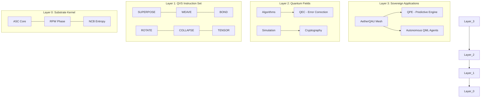

# ⚛️ Quantum Absolute Unit (QAU) - The Sovereign Substrate

[](https://github.com/ethcocoder/quantumpro)
[](https://github.com/ethcocoder/quantumpro)
[](https://github.com/ethcocoder/quantumpro)

> "The QAU is not a simulation. It is a new reality executed natively on silicon."

---

## 🌌 The Vision: Post-Simulation Computing

Current quantum computers are limited by decoherence, and classical simulations are limited by exponential growth. The **Quantum Absolute Unit (QAU)** breaks this deadlock by establishing a **Quantum Virtual Substrate (QVS)**—an operating system layer where quantum primordials are treated as native silicon types.

By utilizing **Sparse Tensor Blocks** and **Shared Constraint Pointers**, the QAU offers near-quantum parallelism on legacy hardware, enabling the simulation of massive field theories and sovereign secure networks.

---

## 🔱 The Three Quantum Primordials

At the heart of the QAU are three irreducible computational essences:

1.  **ASC (Amplitude Superposition Cell)**: The primitive of **Coherent Multiplicity**. A lazy tensor block that holds $2^n$ potential states in a sparse, memory-efficient format.
2.  **RPW (Relative Phase Weave)**: The primitive of **Interference**. Utilizing geometric rotor algebra to perform phase rotations without the overhead of trigonometric functions.
3.  **NCB (Non-Local Correlation Bond)**: The primitive of **Entanglement**. Forging informational constraints that ensure joint probability distributions cannot be factorized.

---

## 🏗️ Project Architecture



---

## ⚡ Real-World Capabilities: AetherQAU

**AetherQAU** is the primary deployment layer of this substrate, providing:

*   **Entanglement-Locked Channels (ELC)**: Instantaneous, un-eavesdroppable key generation using E91-standard NCB bonds.
*   **Quantum Predictive Engine (QPE)**: Solving NP-hard optimization problems via Ising Hamiltonian evolution.
*   **Measurement-First Trajectories**: Running statistically exact quantum simulations at linear speeds.

---

## 🛠️ Usage & Integration

### 💻 Command Line Interface
Interact with the substrate directly:
```bash
python qau_cli.py grover --target 101 --iter 2
python qau_cli.py e91
```

### 🛰️ Master Dashboard
Open `aether_dashboard.html` in any modern browser for a direct holographic view of the Aether Mesh.

### 🐍 Python API
```python
from qau_qvs.core.qvs import QVS

qvs = QVS()
psi = qvs.create_asc(size=3)
qvs.SUPERPOSE(psi, [(0,0,0), (1,1,1)]) # Create GHZ entanglement skeleton
qvs.WEAVE(psi, (0,), 3.14/4)          # Influence phase
result = qvs.COLLAPSE(psi)            # Collapse multiplicity
```

---

## 🚀 The Path Ahead (v2.0 Roadmap)
- [ ] **Matrix Product States (MPS)**: Polynomial memory scaling for 1000+ qubit simulations.
- [ ] **JIT Unitary Synthesis**: Fusing gates into optimized tensor contraction paths.
- [ ] **Quantum Trajectory Monte Carlo**: Resolving many-body field theories in real-time.

---
*Built by the ethcocoder community, 2026. Join the revolution.*
