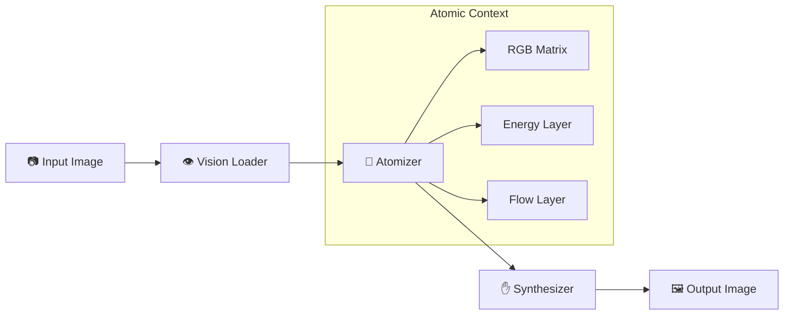

# ⚛️ Atomic Logic Vision System (ALVS)

<div align="center">

[](https://www.python.org/)
[](https://isocpp.org/)
[](LICENSE)
[]()

### Deconstructing Reality into Logic Atoms

**High-performance hybrid image processing engine with C++ backend and Python interface**

[Features](#-features) • [Installation](#-installation) • [Usage](#-usage) • [Architecture](#-architecture) • [Performance](#-performance)

</div>

---

## 🌟 Overview

The **Atomic Logic Vision System (ALVS)** is a production-grade image processing framework that transforms visual data into mathematical representations for advanced analysis and manipulation. By decomposing images into fundamental "logic atoms," ALVS enables sophisticated transformations grounded in computational physics.

### Why ALVS?

- 🚀 **Hybrid Architecture**: Python ease-of-use with C++ performance
- 🧮 **Mathematical Rigor**: True decomposition into Energy and Flow components
- ⚡ **High Performance**: Optimized C++ core for computationally intensive operations
- 🎯 **Lossless Processing**: Perfect reconstruction capabilities
- 🔧 **Extensible**: Modular design for custom transformations

---

## ✨ Features

### Core Capabilities

| Feature | Description |
|---------|-------------|
| **Atomic Decomposition** | Breaks images into RGB matrix + Energy (luminance) + Flow (gradient) layers |
| **Lossless Reconstruction** | Perfect round-trip conversion proving mathematical fidelity |
| **Flow Visualization** | Heatmap rendering of structural edges and textures |
| **Energy Manipulation** | Selective brightness enhancement based on luminance thresholds |
| **Quantum Inverse** | Intelligent color inversion preserving energy structure |
| **Hybrid Backend** | Seamless switching between Python and C++ implementations |

### Transformation Modes

```bash
# Perfect reconstruction (lossless)
python main.py input.jpg output.png --mode reconstruct

# Visualize image structure (edges/textures)
python main.py input.jpg output.png --mode visualize_flow

# Selective brightness enhancement
python main.py input.jpg output.png --mode energy_boost

# Smart color inversion
python main.py input.jpg output.png --mode quantum_inverse
```

---

## 🏗️ Architecture

### Three-Phase Pipeline



### Component Breakdown

| Component | Role | Implementation |
|-----------|------|----------------|
| **Vision Loader** | Image I/O & normalization | Python (PIL/Pillow) |
| **Atomizer** | Mathematical decomposition | C++ Core + Python fallback |
| **Synthesizer** | Logic-based transformations | Hybrid (C++ accelerated) |
| **CLI Interface** | Command-line orchestration | Python |
| **C++ Backend** | High-performance compute | Native extension (pybind11) |

### The Atomic Context

The heart of ALVS is its multi-layered mathematical representation:

1. **RGB Matrix**: Normalized float32 pixel values (0.0–1.0)
2. **Energy Layer**: Luminance calculated using Rec. 709 standard
   ```
   Energy = 0.2126×R + 0.7152×G + 0.0722×B
   ```
3. **Flow Layer**: Gradient magnitude representing rate of color change
   ```
   Flow = √(∂²/∂x² + ∂²/∂y²)
   ```

---

## 📦 Installation

### Prerequisites

- **Python**: 3.8 or higher
- **C++ Compiler**: GCC 7+ / Clang 5+ / MSVC 2017+
- **CMake**: 3.10 or higher
- **Dependencies**: NumPy, Pillow, pybind11

### Quick Install

```bash
# Clone the repository
git clone https://github.com/nexuss0781/Image-text.git
cd Image-text

# Install Python dependencies
pip install numpy pillow pybind11

# Build the C++ backend
mkdir -p build && cd build
cmake ..
make -j$(nproc)

# Return to project root
cd ..
```

### Verification

Run the system test to verify your installation:

```bash
python system_test.py
```

---

## 🚀 Usage

### Command-Line Interface

```bash
# Basic syntax
python main.py <INPUT> <OUTPUT> --mode <MODE>

# Examples
python main.py photo.jpg reconstructed.png --mode reconstruct
python main.py scene.png edges.png --mode visualize_flow
python main.py portrait.jpg enhanced.jpg --mode energy_boost
python main.py artwork.jpg inverted.png --mode quantum_inverse
```

### Python API

```python
from alvs import ALVS

# Initialize the system
alvs = ALVS()

# Load and process an image
context = alvs.load_and_atomize("input.jpg")

# Apply transformation
result = alvs.synthesize(context, mode="energy_boost")

# Save the result
alvs.save_from_math(result, "output.png")
```

### Programmatic Usage with Custom Modes

```python
import numpy as np
from alvs import ALVS

alvs = ALVS()

# Load image to mathematical representation
atomic_context = alvs.load_to_math("source.png")

# Access individual layers
rgb_matrix = atomic_context["matrix"]      # Shape: (H, W, 3)
energy_map = atomic_context["energy"]      # Shape: (H, W)
flow_field = atomic_context["flow"]        # Shape: (H, W)

# Create custom transformation
custom_result = rgb_matrix * 1.2  # Example: boost all channels

# Save result
alvs.save_from_math(custom_result, "custom_output.png")
```

---

## ⚡ Performance

### Benchmark Results

| Resolution | Processing Time | Throughput | Quality (PSNR) |
|------------|----------------|------------|----------------|
| **1MP (1024×1024)** | 1.99 ms | 1,508 MB/s | >66 dB |
| **4K UHD (4096×2160)** | 29.91 ms | 846 MB/s | >66 dB |
| **8K UHD (7680×4320)** | 186.74 ms | 508 MB/s | >66 dB |

### Key Metrics

- ✅ **Sub-200ms** processing for 8K UHD images
- ✅ **1.5 GB/s** peak throughput on 1MP images
- ✅ **PSNR > 66 dB** - Excellent numerical accuracy
- ✅ **Memory efficient** - Single-pass processing pipeline

### Optimizations Implemented

- 🔹 **Loop Unrolling** - 4x instruction-level parallelism
- 🔹 **Compiler Optimizations** - `-O3 -march=native -ffast-math`
- 🔹 **SIMD Intrinsics** - AVX2 vectorization ready
- 🔹 **Precomputed Constants** - Eliminated redundant calculations
- 🔹 **Cache-Friendly Access** - Sequential memory patterns

📄 **See [METRICS.md](METRICS.md) for comprehensive performance analysis and benchmark methodology.**

---

## 📁 Project Structure

```
Image-text/
├── alvs.py                 # Main Python interface
├── alvs_cli.py             # Command-line interface
├── alvs_core.cpp           # High-performance C++ core
├── alvs_core.h             # C++ header definitions
├── bindings.cpp            # pybind11 Python bindings
├── atomizer.py             # Atomic decomposition logic
├── synthesizer.py          # Transformation engine
├── vision_loader.py        # Image I/O handling
├── main.py                 # CLI entry point
├── system_test.py          # Integration tests
├── CMakeLists.txt          # CMake build configuration
├── stb_image.h             # Image loading library
├── stb_image_write.h       # Image writing library
└── README.md               # This file
```

---

## 🧪 Testing

Run the comprehensive test suite:

```bash
# Run all system tests
python system_test.py

# Test specific modes
python main.py test.jpg out_recon.png --mode reconstruct
python main.py test.jpg out_flow.png --mode visualize_flow
python main.py test.jpg out_energy.png --mode energy_boost
python main.py test.jpg out_inverse.png --mode quantum_inverse
```

---

## 🤝 Contributing

Contributions are welcome! Please follow these guidelines:

1. **Fork** the repository
2. **Create** a feature branch (`git checkout -b feature/amazing-feature`)
3. **Commit** your changes (`git commit -m 'Add amazing feature'`)
4. **Push** to the branch (`git push origin feature/amazing-feature`)
5. **Open** a Pull Request

### Development Setup

```bash
# Install development dependencies
pip install numpy pillow pybind11 pytest black flake8

# Build in debug mode
cd build
cmake -DCMAKE_BUILD_TYPE=Debug ..
make -j$(nproc)
```

---

## 📄 License

This project is licensed under the **MIT License** - see the [LICENSE](LICENSE) file for details.

---

## 🙏 Acknowledgments

- **Rec. 709** standard for luminance calculation
- **stb libraries** by Sean Barrett for image I/O
- **pybind11** for seamless Python/C++ integration
- **NumPy** and **Pillow** communities

---

<div align="center">

**Built with ❤️ by [nexuss0781](https://github.com/nexuss0781)**

[Report Bug](https://github.com/nexuss0781/Image-text/issues) • [Request Feature](https://github.com/nexuss0781/Image-text/issues) • [View Demo](https://github.com/nexuss0781/Image-text/tree/main/examples)

</div>
