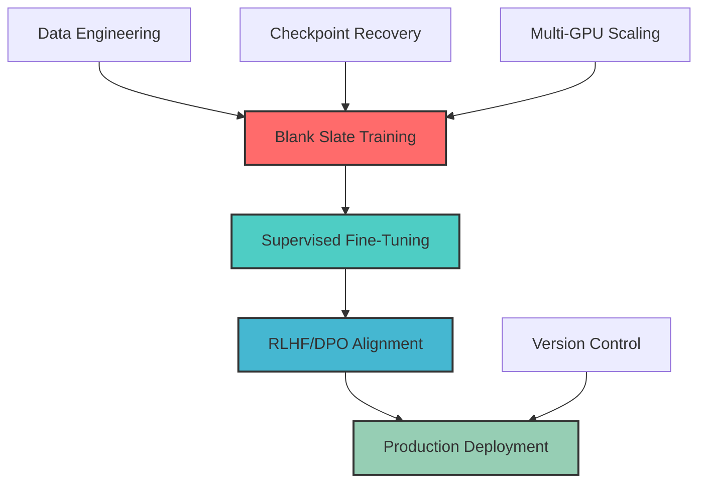
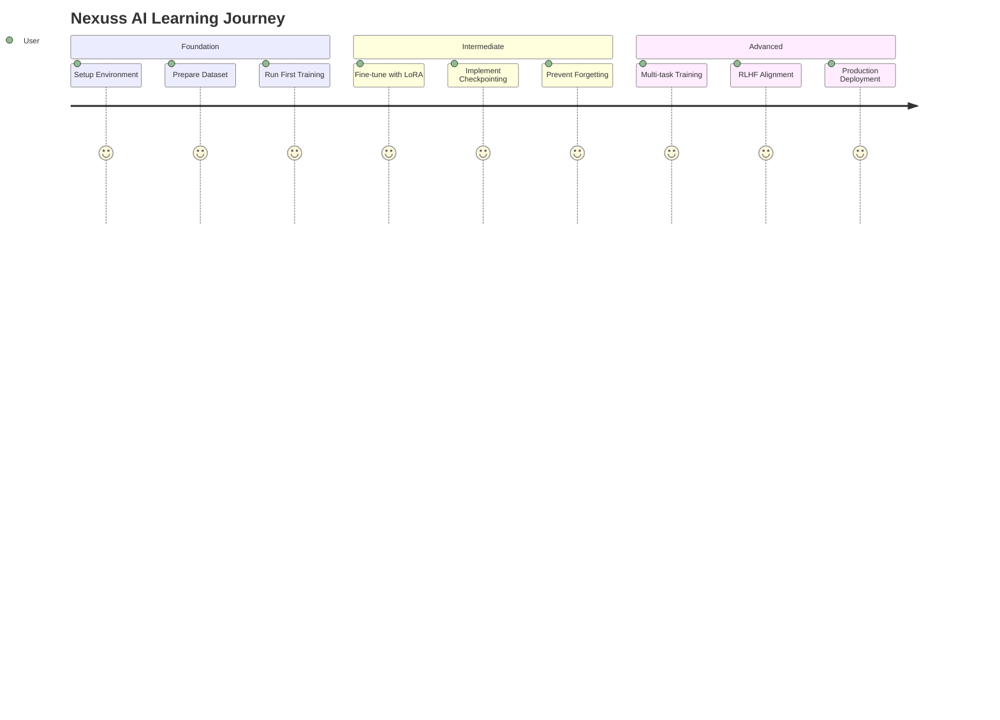
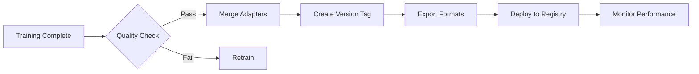

# 🌌 Nexuss AI: The Ultimate LLM Training Framework

<div align="center">


**From Blank Slate to Production-Ready AI**  
*Train • Fine-Tune • Align • Deploy • Scale*

[📚 Documentation](#-documentation) | [🚀 Quick Start](#-quick-start) | [🎯 Features](#-features) | [📖 Training Guide](TRAINING.md)

</div>

---

## 🌟 Welcome to Nexuss AI

**Nexuss AI** is an enterprise-grade, comprehensive framework designed for building large language models **from absolute scratch**. Whether you're training your first model or deploying production AI systems at scale, Nexuss provides the complete toolkit for every stage of the AI lifecycle.

### ✨ Why Choose Nexuss AI?

<div align="center">

| 🎯 **Pure Training** | 🔧 **Flexible Fine-Tuning** | 🛡️ **Knowledge Retention** |
|:---:|:---:|:---:|
| Train from random weights with no pre-trained baggage | LoRA, QLoRA, Full Fine-tuning support | Advanced strategies to prevent catastrophic forgetting |

| 🚀 **Production Ready** | 📊 **Full Observability** | 🌍 **Multi-Format Support** |
|:---:|:---:|:---:|
| Version control, checkpointing, deployment pipelines | WandB, TensorBoard, custom metrics | JSON, Parquet, JSONL, streaming datasets |

</div>

---

## 🎯 Features

### 🔥 Core Capabilities



#### 🏗️ **Training Modalities**
- **Pre-training from Scratch**: Initialize and train models with random weights
- **Supervised Fine-Tuning (SFT)**: Instruction tuning with conversational data
- **Reinforcement Learning**: DPO, KTO, and PPO for human alignment
- **Continual Learning**: Add new capabilities without forgetting old ones

#### ⚡ **Efficiency Technologies**
- **LoRA/QLoRA**: Parameter-efficient fine-tuning (up to 10x memory reduction)
- **4-bit/8-bit Quantization**: Train larger models on consumer hardware
- **Gradient Checkpointing**: Trade compute for memory efficiency
- **Flash Attention**: Optimized attention mechanisms for speed
- **DeepSpeed Integration**: ZeRO optimization for distributed training

#### 🛡️ **Catastrophic Forgetting Prevention**
- **Adapter-Based Architecture**: Maintain separate adapters for different tasks
- **Data Mixing Strategies**: Combine multiple datasets during training
- **Replay Buffers**: Include historical data in new training runs
- **Progressive Freezing**: Freeze layers selectively during fine-tuning

#### 📦 **Production Features**
- **Automatic Checkpointing**: Resume training from any point
- **Version Management**: Track and deploy multiple model versions
- **Model Merging**: Combine adapters into standalone models
- **Export Pipelines**: Convert to ONNX, GGUF, vLLM formats
- **A/B Testing Support**: Compare model versions in production

---

## 🚀 Quick Start

### 1️⃣ Installation

```bash
# Clone the repository
git clone https://github.com/nexuss-ai/nexuss-framework.git
cd nexuss-framework

# Install core dependencies
pip install -e ".[torch]"

# For GPU training with quantization
pip install -e ".[torch,bitsandbytes]"

# For distributed training
pip install -e ".[torch,deepspeed]"
```

### 2️⃣ Prepare Your Dataset

Create your training data in `/workspace/data/`:

**Pre-training Format** (`my_data.jsonl`):
```json
{"text": "Your raw text document here..."}
{"text": "Another document for training..."}
```

**Instruction Tuning Format** (`instruction_data.jsonl`):
```json
{
  "messages": [
    {"role": "user", "content": "What is AI?"},
    {"role": "assistant", "content": "AI stands for Artificial Intelligence..."}
  ]
}
```

Register in `data/dataset_info.json`:
```json
{
  "nexuss_pretrain": {
    "file_name": "my_data.jsonl",
    "columns": {"prompt": "text"}
  },
  "nexuss_sft": {
    "file_name": "instruction_data.jsonl",
    "formatting": "sharegpt"
  }
}
```

### 3️⃣ Training Commands

#### 🎓 Pre-training from Scratch
```bash
python src/train.py \
    --stage pt \
    --model_name_or_path meta-llama/Llama-3.2-1B \
    --use_tiktoken true \
    --tiktoken_encoding cl100k_base \
    --do_train \
    --dataset nexuss_pretrain \
    --dataset_dir data \
    --output_dir output/nexuss_base_v1 \
    --per_device_train_batch_size 2 \
    --gradient_accumulation_steps 8 \
    --learning_rate 1e-4 \
    --num_train_epochs 3 \
    --fp16
```

#### 🎯 Fine-tuning with LoRA
```bash
python src/train.py \
    --stage sft \
    --model_name_or_path output/nexuss_base_v1 \
    --do_train \
    --dataset nexuss_sft \
    --finetuning_type lora \
    --lora_rank 64 \
    --lora_alpha 128 \
    --output_dir output/nexuss_sft_v1 \
    --per_device_train_batch_size 4 \
    --learning_rate 2e-4 \
    --num_train_epochs 2
```

#### 🔄 Resume from Checkpoint
```bash
python src/train.py \
    --stage sft \
    --model_name_or_path output/nexuss_base_v1 \
    --resume_from_checkpoint output/nexuss_sft_v1/checkpoint-500 \
    --do_train \
    --dataset nexuss_sft \
    --finetuning_type lora \
    --output_dir output/nexuss_sft_v1
```

#### 🤝 DPO Alignment
```bash
python src/train.py \
    --stage dpo \
    --model_name_or_path output/nexuss_sft_v1 \
    --ref_model output/nexuss_sft_v1 \
    --do_train \
    --dataset preference_data \
    --finetuning_type lora \
    --output_dir output/nexuss_dpo_v1 \
    --per_device_train_batch_size 2 \
    --learning_rate 5e-6
```

---

## 📚 Documentation

### 📖 Complete Guides

| Guide | Description | Link |
|-------|-------------|------|
| **Training Guide** | End-to-end workflow from data to deployment | [TRAINING.md](TRAINING.md) |
| **Data Engineering** | Dataset preparation, formatting, and quality | [data/README.md](data/README.md) |
| **Architecture Deep Dive** | Technical analysis of the framework | [NEXUSS_AI_DEEP_DIVE.md](NEXUSS_AI_DEEP_DIVE.md) |
| **API Reference** | Programmatic usage and integration | [src/api.py](src/api.py) |

### 🎓 Learning Path



---

## 🏗️ Architecture Overview

### System Components

<div align="center">

```
┌─────────────────────────────────────────────────────────────┐
│                    NEXUSS AI FRAMEWORK                       │
├─────────────────────────────────────────────────────────────┤
│  ┌──────────────┐  ┌──────────────┐  ┌──────────────┐      │
│  │   Data       │  │   Training   │  │   Evaluation │      │
│  │   Pipeline   │→ │   Engine     │→ │   Suite      │      │
│  └──────────────┘  └──────────────┘  └──────────────┘      │
│         ↓                  ↓                  ↓              │
│  ┌──────────────┐  ┌──────────────┐  ┌──────────────┐      │
│  │  Tokenizer   │  │   PEFT/LoRA  │  │   Metrics    │      │
│  │  (Tiktoken)  │  │   Adapter    │  │   Dashboard  │      │
│  └──────────────┘  └──────────────┘  └──────────────┘      │
│         ↓                  ↓                  ↓              │
│  ┌──────────────────────────────────────────────────────┐  │
│  │              Model Registry & Versioning             │  │
│  └──────────────────────────────────────────────────────┘  │
└─────────────────────────────────────────────────────────────┘
```

</div>

### Training Workflow

1. **Data Preparation** → Format, validate, and register datasets
2. **Base Training** → Pre-train from scratch or initialize architecture
3. **Fine-Tuning** → Adapt to specific tasks with LoRA/Full FT
4. **Alignment** → RLHF/DPO for human preference optimization
5. **Validation** → Evaluate performance on held-out test sets
6. **Versioning** → Tag, merge, and prepare for deployment
7. **Deployment** → Export to production formats (ONNX, GGUF, vLLM)
8. **Monitoring** → Track performance and trigger retraining

---

## 🛡️ Catastrophic Forgetting Solutions

### Problem Statement
When fine-tuning sequentially on Task A then Task B, the model forgets Task A knowledge.

### Nexuss AI Solutions

#### ✅ Strategy 1: Adapter-Based Isolation
```bash
# Train separate adapters for each task
python train.py --dataset task_a --output_dir adapters/task_a
python train.py --dataset task_b --output_dir adapters/task_b

# Load specific adapter at inference
model.load_adapter("adapters/task_a")  # Switch to task A
model.load_adapter("adapters/task_b")  # Switch to task B
```

#### ✅ Strategy 2: Data Mixing
```bash
# Combine datasets for multi-task learning
python train.py \
    --dataset task_a_data,task_b_data \
    --mix_strategy concat \
    --output_dir output/multi_task_model
```

#### ✅ Strategy 3: Replay Buffer
```json
// Include 20% of old data in new training
{
  "new_task_data": 80%,
  "replay_buffer": 20%  // Samples from previous tasks
}
```

#### ✅ Strategy 4: Progressive Freezing
```bash
# Freeze early layers, train only later layers
python train.py \
    --freeze_layers 0-15 \
    --trainable_layers 16-31 \
    --output_dir output/frozen_finetune
```

---

## 📦 Version Control & Release

### Version Naming Convention
```
nexuss-{type}-{version}-{date}
├── nexuss-base-v1-20260101
├── nexuss-sft-v1-20260115
├── nexuss-dpo-v1-20260120
└── nexuss-multitask-v2-20260201
```

### Release Workflow



### Export Commands
```bash
# Merge LoRA adapter into base model
python scripts/merge_lora.py \
    --model_name_or_path output/nexuss_base_v1 \
    --adapter_name_or_path output/nexuss_sft_v1 \
    --output_dir output/nexuss_merged_v1

# Export to GGUF for llama.cpp
python scripts/export_gguf.py \
    --model output/nexuss_merged_v1 \
    --outfile nexuss-v1.Q4_K_M.gguf

# Export to ONNX for production
python scripts/export_onnx.py \
    --model output/nexuss_merged_v1 \
    --output nexuss-v1.onnx
```

---

## 🔧 Configuration Examples

### Full Configuration File (`config.yaml`)
```yaml
model:
  name_or_path: meta-llama/Llama-3.2-1B
  use_tiktoken: true
  tiktoken_encoding: cl100k_base
  
training:
  stage: pt  # pt, sft, dpo, ppo
  do_train: true
  per_device_train_batch_size: 2
  gradient_accumulation_steps: 8
  learning_rate: 1e-4
  num_train_epochs: 3
  fp16: true
  save_steps: 500
  logging_steps: 10

lora:
  finetuning_type: lora
  lora_rank: 64
  lora_alpha: 128
  lora_dropout: 0.05
  target_modules: all

data:
  dataset: nexuss_pretrain
  dataset_dir: data
  template: default

output:
  output_dir: output/nexuss_base_v1
  overwrite_output_dir: true
```

---

## 🌍 Supported Models & Architectures

| Architecture | Pre-training | SFT | LoRA | QLoRA | DPO |
|--------------|-------------|-----|------|-------|-----|
| LLaMA 2/3    | ✅ | ✅ | ✅ | ✅ | ✅ |
| Mistral      | ✅ | ✅ | ✅ | ✅ | ✅ |
| Qwen         | ✅ | ✅ | ✅ | ✅ | ✅ |
| DeepSeek     | ✅ | ✅ | ✅ | ✅ | ✅ |
| Custom       | ✅ | ✅ | ✅ | ✅ | ✅ |

---

## 📊 Performance Benchmarks

<div align="center">

| Method | Memory Usage | Training Speed | Quality | Best For |
|--------|-------------|----------------|---------|----------|
| **Full FT** | 80GB | 1.0x | ⭐⭐⭐⭐⭐ | Final production models |
| **LoRA** | 24GB | 1.5x | ⭐⭐⭐⭐ | Rapid prototyping |
| **QLoRA** | 12GB | 1.3x | ⭐⭐⭐⭐ | Resource-constrained |
| **Pre-training** | 128GB+ | 0.5x | ⭐⭐⭐⭐⭐ | Base model creation |

</div>

---

## 🤝 Contributing

We welcome contributions! Please follow these steps:

1. Fork the repository
2. Create a feature branch (`git checkout -b feature/amazing-feature`)
3. Commit your changes (`git commit -m 'Add amazing feature'`)
4. Push to the branch (`git push origin feature/amazing-feature`)
5. Open a Pull Request

### Contribution Areas
- 🐛 Bug fixes
- ✨ New features
- 📚 Documentation improvements
- 🧪 Test coverage
- 🚀 Performance optimizations

---

## 📄 License

This project is licensed under the Apache License 2.0 - see the [LICENSE](LICENSE) file for details.

---

## 🙏 Acknowledgments

- Built upon the [LLaMA-Factory](https://github.com/hiyouga/LLaMA-Factory) framework
- Thanks to the Hugging Face community
- Inspired by research from Meta AI, Google DeepMind, and OpenAI

---

<div align="center">

### 🌟 Made with ❤️ by the Nexuss AI Team

**Building the Future of AI, One Model at a Time**

[📧 Contact Us](mailto:support@nexuss.ai) | [🐦 Twitter](https://twitter.com/nexuss_ai) | [💬 Discord](https://discord.gg/nexuss-ai)


</div>
